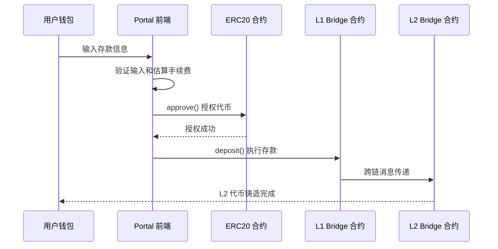
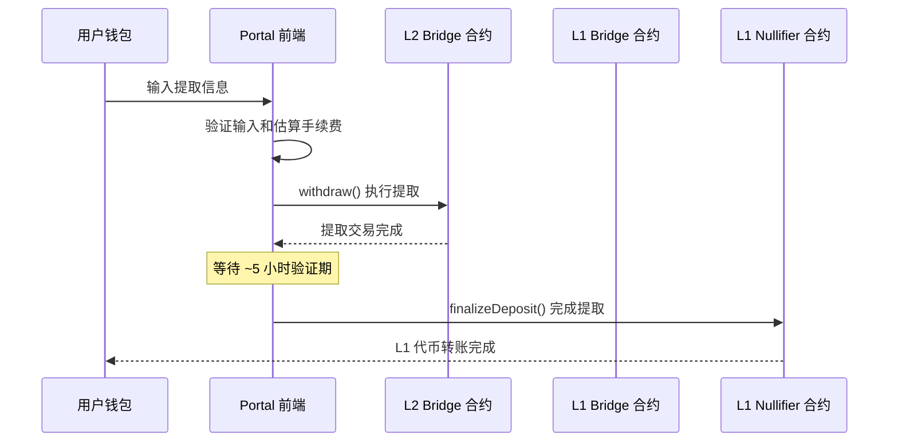

# zkSync Portal - Deposit & Withdraw 技术流程文档

## 📋 概述

本文档详细描述了 zkSync Portal 中存款 (Deposit) 和提取 (Withdraw) 的完整技术流程，包括涉及的合约地址、方法调用、参数传递和状态管理。

## 🏗️ 架构概览

```
L1 (Ethereum/BSC)           L2 (zkSync Era/BSC zkStack)
┌─────────────────┐         ┌─────────────────┐
│   L1 Bridge     │◄────────┤   L2 Bridge     │
│   Contract      │         │   Contract      │
└─────────────────┘         └─────────────────┘
         │                           │
         ▼                           ▼
┌─────────────────┐         ┌─────────────────┐
│  L1 Nullifier   │         │ Asset Router    │
│   Contract      │         │   Contract      │
└─────────────────┘         └─────────────────┘
```

## 🔄 DEPOSIT (存款) 流程

### 1. 流程概览



### 2. 代码文件结构

```
views/transactions/Deposit.vue           # 存款页面主组件
├── composables/zksync/deposit/
│   ├── useFee.ts                       # 手续费估算逻辑
│   ├── useTransaction.ts               # 交易执行逻辑
│   └── useEcosystemBanner.ts          # 生态横幅管理
├── composables/transaction/
│   └── useAllowance.ts                 # 代币授权管理
└── store/ethereumBalance.ts            # L1 余额管理
```

### 3. 详细技术流程

#### 3.1 页面初始化 (`views/transactions/Deposit.vue`)

```typescript
// 初始化存储和状态
const onboardStore = useOnboardStore();
const tokensStore = useZkSyncTokensStore();
const providerStore = useZkSyncProviderStore();
const zkSyncEthereumBalance = useZkSyncEthereumBalanceStore();

// 获取网络配置
const { eraNetwork } = storeToRefs(providerStore);
const { destinations } = storeToRefs(useDestinationsStore());

// 支持的网络映射
// L1: Ethereum Mainnet (1), Sepolia (11155111), BSC Testnet (97)
// L2: zkSync Era (324), zkSync Sepolia (300), BSC zkStack (9720)
```

#### 3.2 代币授权检查 (`composables/transaction/useAllowance.ts`)

**涉及合约**: ERC20 代币合约
**合约方法**: `allowance()`, `approve()`

```typescript
// 1. 检查当前授权额度
const allowance = await publicClient.readContract({
  address: tokenAddress.value as Hash,    // ERC20 代币合约地址
  abi: IERC20,                           // 标准 ERC20 ABI
  functionName: "allowance",             // 方法: allowance(owner, spender)
  args: [accountAddress.value, contractAddress], // 参数: [用户地址, 桥合约地址]
});

// 2. 设置代币授权 (如果需要)
const txResponse = await wallet?.approveERC20(
  approvalAmounts[i].token,              // 代币地址
  approvalAmounts[i].allowance           // 授权金额
);

// 实际调用的合约方法
// ERC20.approve(spender: address, amount: uint256) returns (bool)
```

**合约地址获取**:
```typescript
// 获取桥合约地址用于授权
const bridgeAddresses = await provider.getDefaultBridgeAddresses();
const spenderAddress = bridgeAddresses.sharedL1; // L1 Bridge 合约地址
```

#### 3.3 手续费估算 (`composables/zksync/deposit/useFee.ts`)

**涉及合约**: L1 Bridge 合约
**合约方法**: `getFullRequiredDepositFee()`

```typescript
// BSC 网络特殊处理
const isBscNetwork = computed(() => {
  return networkStore.selectedNetwork?.l1Network?.id === 97; // BSC Testnet
});

// 获取 ETH 存款手续费
const getEthTransactionFee = async () => {
  const signer = await getL1VoidSigner();
  
  const feeData = await signer.getFullRequiredDepositFee({
    token: utils.ETH_ADDRESS,            // ETH 地址 (0x000...000)
    to: params.to,                       // L2 接收地址
  });
  
  // 返回的费用结构
  return {
    l1GasLimit: feeData.l1GasLimit,      // L1 gas 限制
    baseCost: feeData.baseCost,          // 基础成本
    maxFeePerGas: feeData.maxFeePerGas,  // 最大 gas 价格 (EIP-1559)
    maxPriorityFeePerGas: feeData.maxPriorityFeePerGas, // 优先费用
  };
};

// ERC20 代币存款手续费 (固定值)
const getERC20TransactionFee = () => {
  return {
    l1GasLimit: BigInt(utils.L1_RECOMMENDED_MIN_ERC20_DEPOSIT_GAS_LIMIT), // 约 300,000
  };
};

// BSC 网络强制使用传统交易类型
if (fee.value) {
  fee.value.gasPrice = await getGasPrice();     // 传统 gas 价格
  fee.value.maxFeePerGas = undefined;           // 禁用 EIP-1559
  fee.value.maxPriorityFeePerGas = undefined;   // 禁用 EIP-1559
  
  // 应用 130% 安全缓冲区
  fee.value.l1GasLimit = (fee.value.l1GasLimit * 130n) / 100n;
  if (fee.value.baseCost) {
    fee.value.baseCost = (fee.value.baseCost * 130n) / 100n;
  }
}
```

#### 3.4 存款交易执行 (`composables/zksync/deposit/useTransaction.ts`)

##### 3.4.1 标准存款流程

**涉及合约**: L1 Bridge 合约 (SharedBridge)
**合约地址**: `provider.getDefaultBridgeAddresses().sharedL1`
**合约方法**: `deposit()`

```typescript
// 标准存款调用
const depositResponse = await wallet.deposit({
  to: transaction.to,                    // L2 接收地址
  token: transaction.tokenAddress,       // L1 代币地址
  amount: transaction.amount,            // 存款金额
  l2GasLimit: fee.l2GasLimit,           // L2 gas 限制
  approveBaseERC20: true,               // 自动处理 ERC20 授权
  overrides: {
    type: 0,                            // 强制传统交易类型 (BSC 兼容)
    gasPrice: fee.gasPrice,             // gas 价格
    gasLimit: fee.l1GasLimit,           // gas 限制
  },
});

// 底层实际调用的合约方法 (zkSync SDK 内部)
// L1SharedBridge.deposit(
//   _chainId: uint256,           // 链 ID (324 for Era, 9720 for BSC zkStack)
//   _prevMsgSender: address,     // 发送者地址
//   _l1Token: address,           // L1 代币地址
//   _amount: uint256,            // 存款金额
//   _l2TxGasLimit: uint256,      // L2 交易 gas 限制
//   _l2TxGasPerPubdataByte: uint256, // 每字节 pubdata 的 gas
//   _refundRecipient: address    // 退款接收者
// ) payable returns (bytes32 txHash)
```

##### 3.4.2 自定义桥接存款流程

**涉及合约**: 自定义 L1 Bridge 合约
**合约地址**: `transaction.bridgeAddress` (来自 customBridgeTokens 配置)
**合约方法**: `deposit()`

```typescript
// 自定义桥接存款
const handleCustomBridgeDeposit = async (transaction, fee) => {
  // 1. 获取 L2 桥合约地址
  const l2BridgeAddress = await readContract(wagmiConfig, {
    address: transaction.bridgeAddress as Address,
    abi: L1_BRIDGE_ABI,
    functionName: "l2Bridge",            // 获取对应的 L2 桥地址
  });
  
  // 2. 获取桥接数据
  const bridgeData = await getERC20DefaultBridgeData(
    transaction.tokenAddress, 
    l1Signer.provider
  );
  
  // 3. 估算 L2 gas
  const l2GasLimit = await l1Signer.providerL2.estimateCustomBridgeDepositL2Gas(
    transaction.bridgeAddress,           // L1 桥地址
    l2BridgeAddress,                    // L2 桥地址
    transaction.tokenAddress,           // 代币地址
    transaction.amount.toString(),      // 金额
    transaction.to,                     // 接收者
    bridgeData,                         // 桥接数据
    l1Signer.address,                   // 发送者
    gasPerPubdata,                      // gas per pubdata
    l2Value                             // L2 value
  );
  
  // 4. 计算基础成本
  const baseCost = await l1Signer.getBaseCost({
    gasLimit: l2GasLimit,
    gasPerPubdataByte: gasPerPubdata,
  });
  
  // 5. 执行自定义桥接存款
  const hash = await writeContract(wagmiConfig, {
    address: transaction.bridgeAddress as Address,
    abi: L1_BRIDGE_ABI,
    functionName: "deposit",             // 自定义桥的 deposit 方法
    args: [
      transaction.to,                    // L2 接收地址
      transaction.tokenAddress,          // L1 代币地址
      BigInt(transaction.amount.toString()), // 存款金额
      transaction.l2GasLimit ?? 400000n, // L2 gas 限制
      gasPerPubdata,                     // gas per pubdata 限制
      transaction.refundRecipient ?? zeroAddress, // 退款接收者
    ],
    value: baseCost,                     // 支付的 ETH (用于 L2 gas)
  });
};

// 自定义桥合约方法签名
// CustomL1Bridge.deposit(
//   _l2Receiver: address,        // L2 接收地址
//   _l1Token: address,           // L1 代币地址
//   _amount: uint256,            // 存款金额
//   _l2TxGasLimit: uint256,      // L2 交易 gas 限制
//   _l2TxGasPerPubdataByte: uint256, // 每字节 pubdata 的 gas
//   _refundRecipient: address    // 退款接收者地址
// ) payable returns (bytes32)
```

#### 3.5 交易状态跟踪

```typescript
// 保存交易信息到本地存储
transactionInfo.value = {
  type: "deposit",
  transactionHash: tx.hash,              // L1 交易哈希
  timestamp: new Date().toISOString(),
  token: transaction.token,              // 代币信息
  from: {
    address: transaction.from.address,   // L1 发送地址
    destination: destinations.value.ethereum, // L1 网络信息
  },
  to: {
    address: transaction.to.address,     // L2 接收地址
    destination: destinations.value.era, // L2 网络信息
  },
  info: {
    expectedCompleteTimestamp: new Date(
      new Date().getTime() + ESTIMATED_DEPOSIT_DELAY // 预计完成时间 (~15分钟)
    ).toISOString(),
    completed: false,
  },
};

// 等待交易完成
waitForCompletion(transactionInfo.value)
  .then((completedTransaction) => {
    // 存款完成后的处理
    transfersHistoryStore.reloadRecentTransfers();
    eraWalletStore.requestBalance({ force: true });
  });
```

## 🔄 WITHDRAW (提取) 流程

### 1. 流程概览



### 2. 详细技术流程

#### 2.1 提取交易执行 (`composables/zksync/useTransaction.ts`)

##### 2.1.1 标准提取流程

**涉及合约**: L2 Bridge 合约 (SharedBridge)
**合约地址**: `provider.getDefaultBridgeAddresses().sharedL2`
**合约方法**: `withdraw()`

```typescript
// 获取提取交易请求
const txRequest = await provider.getWithdrawTx({
  from: accountAddress,                  // L2 发送地址
  to: transaction.to,                    // L1 接收地址
  token: transaction.tokenAddress,       // L2 代币地址
  amount: transaction.amount,            // 提取金额
  bridgeAddress,                         // 桥合约地址
  overrides: {
    gasPrice: fee.gasPrice,              // gas 价格
    gasLimit: fee.gasLimit,              // gas 限制
  },
});

// 发送交易
const txResponse = await signer.sendTransaction(txRequest);

// 底层实际调用的合约方法 (zkSync SDK 内部)
// L2SharedBridge.withdraw(
//   _l1Receiver: address,        // L1 接收地址
//   _l2Token: address,           // L2 代币地址
//   _amount: uint256             // 提取金额
// ) returns (bytes32 txHash)
```

##### 2.1.2 自定义桥接提取流程

**涉及合约**: 自定义 L2 Bridge 合约
**合约地址**: `token.l2BridgeAddress`
**合约方法**: `withdraw()`

```typescript
// 自定义桥接提取
const getCustomWithdrawTx = async (transaction) => {
  const provider = await getProvider();
  
  // 连接到自定义 L2 桥合约
  const bridge = await provider.connectL2Bridge(transaction.bridgeAddress);
  
  // 构建提取交易
  let populatedTx = await bridge.withdraw.populateTransaction(
    transaction.to,                      // L1 接收地址
    transaction.token,                   // L2 代币地址
    transaction.amount,                  // 提取金额
    {
      from: transaction.from,            // L2 发送地址
      type: EIP712_TX_TYPE,             // zkSync EIP712 交易类型
      gasPrice: transaction.overrides.gasPrice,
      gasLimit: transaction.overrides.gasLimit,
    }
  );
  
  return populatedTx;
};

// 自定义桥合约方法签名
// CustomL2Bridge.withdraw(
//   _l1Receiver: address,        // L1 接收地址
//   _l2Token: address,           // L2 代币地址
//   _amount: uint256             // 提取金额
// ) returns (bytes32)
```

##### 2.1.3 原生代币提取流程 (Asset Router)

**涉及合约**: L2 Asset Router 合约
**合约地址**: `L2_ASSET_ROUTER_ADDRESS`
**合约方法**: `withdraw(bytes32 _assetId, bytes _assetData)`

```typescript
// 原生代币提取 (通过 Asset Router)
if (params.isNativeToken && params.assetId) {
  // 1. 编码资产数据
  const assetData = AbiCoder.defaultAbiCoder().encode(
    ["uint256", "address", "address"],   // 编码类型
    [params.amount, params.to, params.tokenAddress] // [金额, 接收地址, 代币地址]
  );
  
  // 2. 构建交易数据
  const withdrawFunction = {
    inputs: [
      { internalType: "bytes32", name: "_assetId", type: "bytes32" },
      { internalType: "bytes", name: "_assetData", type: "bytes" },
    ],
    name: "withdraw",
    outputs: [{ internalType: "bytes32", name: "", type: "bytes32" }],
    stateMutability: "nonpayable",
    type: "function",
  };
  
  // 3. 估算 gas
  return estimateGas(wagmiConfig, {
    to: L2_ASSET_ROUTER_ADDRESS,         // Asset Router 合约地址
    data: encodeFunctionData({
      abi: [withdrawFunction],
      functionName: "withdraw",
      args: [params.assetId, assetData], // [资产 ID, 编码的资产数据]
    }),
  });
}

// Asset Router 合约方法签名
// L2AssetRouter.withdraw(
//   _assetId: bytes32,           // 资产 ID
//   _assetData: bytes            // 编码的资产数据 (金额, 接收地址, 代币地址)
// ) returns (bytes32)
```

#### 2.2 提取完成处理 (`composables/zksync/useWithdrawalFinalization.ts`)

##### 2.2.1 获取完成参数

```typescript
// 获取提取完成所需的参数
const getFinalizationParams = async () => {
  const provider = await providerStore.requestProvider();
  const wallet = new Wallet(
    "0x7726827caac94a7f9e1b160f7ea819f172f7b6f9d2a97f992c38edeab82d4110", // 随机私钥
    provider
  );
  
  // 获取完成提取所需的证明参数
  return await wallet.getFinalizeWithdrawalParams(
    transactionInfo.value.transactionHash  // L2 提取交易哈希
  );
};

// 返回的参数结构
// {
//   l1BatchNumber: bigint,       // L1 批次号
//   l2MessageIndex: bigint,      // L2 消息索引
//   l2TxNumberInBlock: number,   // 区块中的交易号
//   message: bytes,              // 跨链消息
//   proof: bytes32[],            // Merkle 证明
//   sender: address              // L2 发送者地址
// }
```

##### 2.2.2 标准提取完成流程

**涉及合约**: L1 Nullifier 合约
**合约地址**: 通过 `IL1AssetRouterFactory.connect().L1_NULLIFIER()` 获取
**合约方法**: `finalizeDeposit()`

```typescript
// 标准提取完成 (通过 L1 Nullifier)
const retrieveL1NullifierAddress = async () => {
  const providerL1 = await walletStore.getL1VoidSigner();
  const bridgeAddresses = await retrieveBridgeAddresses();
  
  return await IL1AssetRouterFactory
    .connect(bridgeAddresses.sharedL1, providerL1)  // 连接到 L1 Asset Router
    .L1_NULLIFIER();                                // 获取 L1 Nullifier 地址
};

// 构建完成交易参数
const finalizeDepositParams = {
  chainId: BigInt(chainId),                // 链 ID
  l1BatchNumber: BigInt(p.l1BatchNumber ?? 0n), // L1 批次号
  l2MessageIndex: BigInt(p.l2MessageIndex), // L2 消息索引
  l2Sender: p.sender as `0x${string}`,     // L2 发送者地址
  l2TxNumberInBatch: Number(p.l2TxNumberInBlock), // 批次中的交易号
  message: p.message,                      // 跨链消息
  merkleProof: p.proof,                    // Merkle 证明
};

// 执行完成交易
const transactionParams = {
  address: l1NullifierAddress,             // L1 Nullifier 合约地址
  abi: IL1Nullifier,                      // L1 Nullifier ABI
  functionName: "finalizeDeposit",         // 完成存款方法
  args: [finalizeDepositParams],           // 完成参数
};

// L1 Nullifier 合约方法签名
// IL1Nullifier.finalizeDeposit(
//   _finalizeDepositParams: FinalizeL1DepositParams
// ) where FinalizeL1DepositParams = {
//   chainId: uint256,            // 链 ID
//   l1BatchNumber: uint256,      // L1 批次号
//   l2MessageIndex: uint256,     // L2 消息索引
//   l2Sender: address,           // L2 发送者地址
//   l2TxNumberInBatch: uint16,   // 批次中的交易号
//   message: bytes,              // 跨链消息
//   merkleProof: bytes32[]       // Merkle 证明
// }
```

##### 2.2.3 自定义桥接完成流程

**涉及合约**: 自定义 L1 Bridge 合约
**合约地址**: `l1BridgeAddress` (来自代币配置或交易信息)
**合约方法**: `finalizeWithdrawal()`

```typescript
// 自定义桥接完成
// 1. 获取自定义桥地址
let l1BridgeAddress = transactionInfo.value.token.l1BridgeAddress;

if (!l1BridgeAddress) {
  const customBridgeToken = customBridgeTokens.find(
    (token) =>
      token.l2Address.toLowerCase() === transactionInfo.value.token.address.toLowerCase() &&
      token.chainId === eraNetwork.value.l1Network?.id
  );
  l1BridgeAddress = customBridgeToken?.l1BridgeAddress;
}

// 2. 构建完成交易参数
const transactionParams = {
  address: l1BridgeAddress as Hash,        // 自定义 L1 Bridge 地址
  abi: L1_BRIDGE_ABI,                     // 自定义桥 ABI
  functionName: "finalizeWithdrawal",      // 完成提取方法
  args: [
    BigInt(p.l1BatchNumber ?? 0n),        // L1 批次号
    BigInt(p.l2MessageIndex),             // L2 消息索引
    Number(p.l2TxNumberInBlock),          // 区块中的交易号
    p.message as `0x${string}`,           // 跨链消息
    p.proof as readonly `0x${string}`[],  // Merkle 证明数组
  ],
};

// 自定义 L1 Bridge 合约方法签名
// CustomL1Bridge.finalizeWithdrawal(
//   _l1BatchNumber: uint256,     // L1 批次号
//   _l2MessageIndex: uint256,    // L2 消息索引
//   _l2TxNumberInBlock: uint16,  // 区块中的交易号
//   _message: bytes,             // 跨链消息
//   _merkleProof: bytes32[]      // Merkle 证明
// )
```

#### 2.3 提取状态管理 (`store/zksync/withdrawals.ts`)

```typescript
// 更新提取状态
const updateWithdrawals = async () => {
  // 1. 从区块浏览器 API 获取提取交易
  const response = await $fetch(
    `${eraNetwork.value.blockExplorerApi}/address/${account.value.address}/transfers?type=withdrawal`
  );
  
  for (const withdrawal of response.items.map(mapApiTransfer)) {
    // 2. 获取交易详情
    const transactionDetails = await provider.getTransactionDetails(
      withdrawal.transactionHash
    );
    
    // 3. 检查是否可以完成提取
    const withdrawalFinalizationAvailable = transactionDetails.status === "verified";
    
    // 4. 检查是否已经完成
    const isFinalized = withdrawalFinalizationAvailable
      ? await signer.isWithdrawalFinalized(withdrawal.transactionHash)
      : false;
    
    // 5. 保存交易状态
    transactionStatusStore.saveTransaction({
      type: "withdrawal",
      transactionHash: withdrawal.transactionHash,
      info: {
        expectedCompleteTimestamp: new Date(
          new Date(withdrawal.timestamp).getTime() + WITHDRAWAL_DELAY // ~5 小时
        ).toISOString(),
        completed: isFinalized,                    // 是否已完成
        withdrawalFinalizationAvailable,           // 是否可以完成
      },
    });
  }
};

// 可完成的提取交易
const withdrawalsAvailableForClaiming = computed(() =>
  userTransactions.value.filter(
    (tx) => tx.type === "withdrawal" && 
           !tx.info.completed && 
           tx.info.withdrawalFinalizationAvailable
  )
);
```

## 📋 合约地址和方法总览

### L1 合约 (Ethereum/BSC)

| 合约名称 | 地址获取方式 | 主要方法 | 用途 |
|---------|-------------|----------|------|
| **L1 Shared Bridge** | `provider.getDefaultBridgeAddresses().sharedL1` | `deposit()` | 标准存款 |
| **L1 Nullifier** | `IL1AssetRouterFactory.connect().L1_NULLIFIER()` | `finalizeDeposit()` | 标准提取完成 |
| **Custom L1 Bridge** | `customBridgeTokens[].l1BridgeAddress` | `deposit()`, `finalizeWithdrawal()` | 自定义代币桥接 |
| **ERC20 Token** | 代币合约地址 | `approve()`, `allowance()` | 代币授权 |

### L2 合约 (zkSync Era/BSC zkStack)

| 合约名称 | 地址获取方式 | 主要方法 | 用途 |
|---------|-------------|----------|------|
| **L2 Shared Bridge** | `provider.getDefaultBridgeAddresses().sharedL2` | `withdraw()` | 标准提取 |
| **L2 Asset Router** | `L2_ASSET_ROUTER_ADDRESS` | `withdraw()` | 原生代币提取 |
| **Custom L2 Bridge** | `token.l2BridgeAddress` | `withdraw()` | 自定义代币提取 |

### 关键常量

```typescript
// 重要地址常量
const L2_BASE_TOKEN_ADDRESS = "0x000000000000000000000000000000000000800A"; // L2 基础代币
const L2_ASSET_ROUTER_ADDRESS = "0x..."; // L2 Asset Router 合约地址
const utils.ETH_ADDRESS = "0x0000000000000000000000000000000000000000"; // ETH 地址

// Gas 限制常量
const L1_RECOMMENDED_MIN_ETH_DEPOSIT_GAS_LIMIT = 150000;   // ETH 存款最小 gas
const L1_RECOMMENDED_MIN_ERC20_DEPOSIT_GAS_LIMIT = 300000; // ERC20 存款最小 gas

// 时间常量
const ESTIMATED_DEPOSIT_DELAY = 15 * 60 * 1000;  // 存款预计时间: 15 分钟
const WITHDRAWAL_DELAY = 5 * 60 * 60 * 1000;     // 提取延迟时间: 5 小时
```

## 🔧 BSC zkStack 特殊配置

### 网络配置 (`hyperchains/config.json`)

```json
{
  "network": {
    "id": 9720,                          // BSC zkStack 链 ID
    "key": "zk_bsc_chain",
    "name": "ZK BSC Chain",
    "rpcUrl": "http://13.228.79.240:3050/",
    "blockExplorerUrl": "http://54.255.170.191:3010",
    "l1Network": {
      "id": 97,                          // BSC Testnet 链 ID
      "name": "BSC Testnet",
      "rpcUrls": {
        "default": {
          "http": ["http://47.130.24.70:10575"]
        }
      }
    }
  }
}
```

### BSC 兼容性处理

```typescript
// 1. 强制使用传统交易类型 (非 EIP-1559)
const overrides = {
  type: 0,                              // 传统交易类型
  gasPrice: fee.gasPrice,               // 使用 gasPrice 而非 maxFeePerGas
  gasLimit: fee.l1GasLimit,
  maxFeePerGas: undefined,              // 禁用 EIP-1559
  maxPriorityFeePerGas: undefined,      // 禁用 EIP-1559
};

// 2. BSC Testnet 回退 gas 价格
const getGasPrice = async () => {
  try {
    const gasPrice = await getPublicClient().getGasPrice();
    return (BigInt(gasPrice) * 130n) / 100n; // 130% 缓冲区
  } catch (error) {
    // BSC Testnet 回退 gas 价格 (6.5 gwei)
    return (BigInt("5000000000") * 130n) / 100n;
  }
};

// 3. 安全缓冲区应用
fee.value.l1GasLimit = (fee.value.l1GasLimit * 130n) / 100n;     // gas 限制 +30%
fee.value.baseCost = (fee.value.baseCost * 130n) / 100n;         // 基础成本 +30%
```

## 🚨 错误处理和重试机制

### 常见错误处理

```typescript
// 1. 余额不足错误
if (message?.startsWith("Not enough balance for deposit!")) {
  const match = message.match(/([\d\\.]+) ETH/);
  if (match?.length) {
    recommendedBalance.value = parseEther(match[1]);
    return; // 显示推荐余额
  }
}

// 2. Gas 费用不足错误
if (message?.includes("insufficient funds for gas * price + value")) {
  throw new Error("Insufficient funds to cover deposit fee! Please, top up your account with ETH.");
}

// 3. 网络错误重试
const retry = async (fn, options = { retries: 3, delay: 1000 }) => {
  for (let i = 0; i < options.retries; i++) {
    try {
      return await fn();
    } catch (error) {
      if (i === options.retries - 1) throw error;
      await new Promise(resolve => setTimeout(resolve, options.delay));
    }
  }
};
```

### 交易状态跟踪

```typescript
// 交易状态枚举
type TransactionStatus = 
  | "not-started"           // 未开始
  | "processing"            // 处理中
  | "waiting-for-signature" // 等待签名
  | "sending"              // 发送中
  | "done";                // 完成

// 状态变化流程
// not-started → processing → waiting-for-signature → sending → done
//                    ↓
//                 error → not-started (重试)
```

## 📊 性能优化

### 缓存机制

```typescript
// 1. 手续费估算缓存 (8 秒)
const cacheEstimateFee = useTimedCache<void, [FeeEstimationParams]>(() => {
  resetEstimateFee();
  return executeEstimateFee();
}, 1000 * 8);

// 2. 桥地址缓存
const retrieveBridgeAddresses = useMemoize(() =>
  getProvider().then((provider) => provider.getDefaultBridgeAddresses())
);

// 3. 自动更新机制
const { reset: resetAutoUpdateEstimate, stop: stopAutoUpdateEstimate } = useInterval(async () => {
  if (!autoUpdatingFee.value) return;
  await estimate();
}, 60000); // 每分钟更新一次手续费
```

### 批量操作优化

```typescript
// 并行获取价格和 gas 限制
const [price, limit] = await Promise.all([
  retry(() => provider.getGasPrice()),
  retry(() => provider.estimateGasWithdraw({...params})),
]);
```

## 🔍 调试和监控

### Sentry 错误捕获

```typescript
const { captureException } = useSentryLogger();

try {
  // 执行操作
} catch (err) {
  captureException({
    error: err as Error,
    parentFunctionName: "functionName",
    parentFunctionParams: [param1, param2],
    filePath: "path/to/file.ts",
  });
  throw err;
}
```

### 事件跟踪

```typescript
// 存款完成事件
trackEvent("deposit", {
  token: transaction.token.symbol,
  amount: transaction.token.amount,
  to: transaction.to.address,
});

// 提取完成事件
trackEvent("withdrawal-finalized", {
  token: transactionInfo.token.symbol,
  amount: transactionInfo.token.amount,
  to: transactionInfo.to.address,
});
```

---

## 📝 总结

本文档详细描述了 zkSync Portal 的存款和提取流程，包括：

1. **存款流程**: L1 → L2 资产转移，涉及代币授权、手续费估算、桥接合约调用
2. **提取流程**: L2 → L1 资产转移，包括提取交易、验证等待、完成处理
3. **合约交互**: 详细的合约地址、方法签名、参数说明
4. **BSC 兼容**: 针对 BSC zkStack 的特殊处理和优化
5. **错误处理**: 完善的错误处理和重试机制
6. **性能优化**: 缓存、批量操作、自动更新等优化策略

该系统支持多种网络环境，具有良好的扩展性和稳定性，为用户提供了安全可靠的跨链资产转移服务。